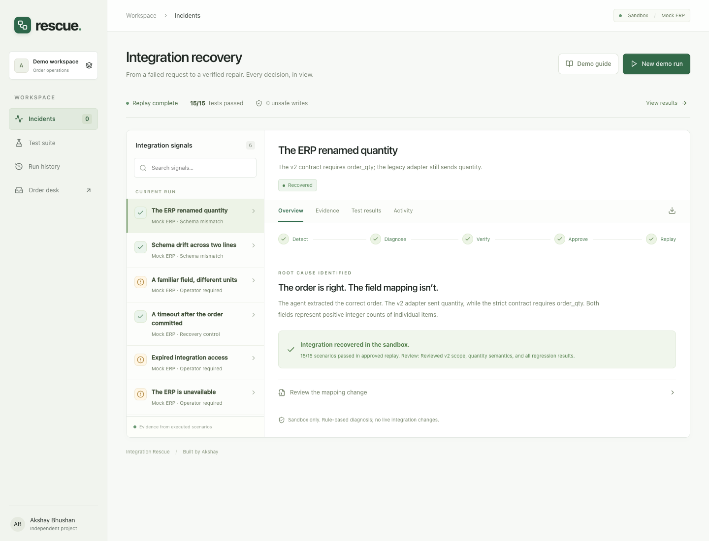
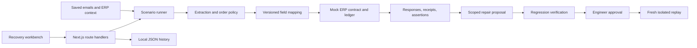

# Integration Rescue

**Find the cause. Verify the repair. Recover with confidence.**

Integration Rescue is a developer workbench for investigating broken order integrations. It captures a failed request, proposes a scoped field-mapping repair, tests that repair against saved scenarios, and requires an engineer’s approval before replay.

Built with **Next.js, React, TypeScript, and Zod**. Runs locally without API keys or external services.



> **Project status:** Working local prototype with a mock ERP and deterministic diagnosis. The recovery workflow executes real code against synthetic scenarios. Live ERP recovery and general-purpose AI diagnosis are future work.

## Why this exists

An agent can understand a customer’s request correctly and still fail because the system it connects to has changed. Renamed fields, different units, expired credentials, and uncertain commit outcomes each require different responses.

Rescue makes that investigation inspectable: what failed, what evidence supports a repair, which behaviors it preserves, and what the engineer approved.

## What you can do

- **Investigate failures:** inspect saved requests, responses, contract checks, and execution events.
- **Review a repair:** compare the proposed mapping with the rejected mapping and supporting evidence.
- **Verify behavior:** execute the same saved inputs against fresh mock ledgers and compare results.
- **Approve and replay:** record a review note, bind approval to the repair artifact, and replay it.
- **Inspect history:** reopen previous runs and export their evidence as JSON.
- **Explore order entry:** use the order desk to turn sample or manually entered emails into reviewed order proposals.

The interface keeps the next action visible and places detailed evidence behind tabs and expandable sections.

## Quick start

### Requirements

- Node.js **20.9 or newer**
- pnpm
- Google Chrome, only for the browser checks

From the repository root:

```sh
pnpm install --frozen-lockfile
pnpm dev
```

Open the local address printed by Next.js, normally [http://127.0.0.1:3000](http://127.0.0.1:3000). If the port is occupied, Next.js may select another port.

| Page                 | Path          | Purpose                                               |
| -------------------- | ------------- | ----------------------------------------------------- |
| Integration recovery | `/`           | Diagnose, verify, approve, and replay sandbox repairs |
| Order desk           | `/order-desk` | Analyze emails and review proposed orders             |

The default mode needs no environment file, database, mailbox, or ERP credentials. Example data loads automatically, and local history is created under `.data/`.

To run a production build locally:

```sh
pnpm build
pnpm start
```

The scripts bind to the local machine. Public hosting requires the deployment work described below.

## The two-minute walkthrough

1. Click **New demo run**. The runner executes 15 scenarios against the legacy adapter.
2. Open **The ERP renamed quantity**. The v2 contract requires `order_qty`, while the adapter sends `quantity`.
3. Click **Diagnose failure**. Review the explanation, expand **Review the mapping change**, and inspect the sources under **Evidence**.
4. Click **Test proposed repair**. The runner executes every saved scenario with the candidate mapping.
5. Inspect **Test results**, enter a review note, and click **Approve repair**.
6. Click **Replay approved repair**. The server checks the approved artifact and executes the suite again with fresh ledgers.
7. Open **Activity** to inspect the decisions, or use the export icon to download the run.

### Measured results for the included corpus

| Execution                     | Expectations met | Unsafe writes | Duplicate writes |
| ----------------------------- | ---------------: | ------------: | ---------------: |
| Legacy adapter baseline       |          13 / 15 |             0 |                0 |
| Candidate repair verification |          15 / 15 |             0 |                0 |
| Approved replay               |          15 / 15 |             0 |                0 |

These values come from execution of the included synthetic fixtures. A passing case means the expected outcome, quantities, and write count matched. A correct refusal can pass; **15/15 does not mean every order was submitted or that production reliability has been established**.

The supported repair changes the v2 quantity mapping while preserving v1 behavior. Credentials, outages, and changed quantity semantics remain operator tasks.

## Scenario coverage

| Area                    | Included cases                                                | Expected behavior                                          |
| ----------------------- | ------------------------------------------------------------- | ---------------------------------------------------------- |
| Normal orders           | Single-item order, multiple items, versioned amendment        | Preserve products, quantities, prices, and order ownership |
| Missing or unsafe input | Ambiguous amendment, hostile email, unknown sender or product | Hold for review                                            |
| Business constraints    | Insufficient stock                                            | Refuse an unsafe proposal                                  |
| Schema drift            | v2 field rename, including a multi-item order                 | Reproduce failure, then verify the scoped mapping repair   |
| Semantic drift          | Individual items changed to cases of 12                       | Refuse a speculative rename                                |
| Duplicate delivery      | Repeated delivery of the same request                         | Reuse the idempotency receipt                              |
| Uncertain commit        | Simulated timeout after a mock commit                         | Look up the receipt before retrying                        |
| External failures       | Expired access, unavailable service                           | Require operator intervention                              |

## Architecture



### Decisions that matter

**Evidence before repair.** Diagnosis requires the supported schema mismatch and passing control fixtures. The current implementation proposes one allowlisted mapping change: `quantity` to `order_qty`, where both represent individual items.

**Verification before approval.** All scenarios must pass with zero unsafe or duplicate writes. A review note is required, and revision checks reject stale decisions.

**Approval belongs to an artifact.** Approval records the repair’s digest. Source, input snapshot, and artifact integrity are checked before subsequent operations. Changing the runner or saved inputs requires a fresh baseline.

**Fresh state for each scenario.** Each fixture uses an isolated mock ledger. Repeated deliveries within that fixture share receipts so deduplication and reconciliation can be asserted.

**Deterministic execution.** The recovery runner calls the mock ERP in process. The HTTP contract probe exposes the same handler, but each HTTP request gets a fresh ledger. Network outages and timeouts are injected behaviors; the suite does not measure real network reliability.

## Project structure

```text
src/
  app/
    page.tsx                  Recovery workbench
    order-desk/page.tsx        Order-entry workspace
    api/lab/route.ts           Recovery lifecycle and approval gates
    api/workspace/route.ts     Order-desk operations
    api/mock-erp/orders/       Stateless HTTP contract probe
  components/
    rescue.tsx                Current recovery interface
    order-desk.tsx            Email and proposal review
  lib/
    agent.ts                  Order validation and policy
    extractor.ts              Mock and optional OpenAI extraction
    store.ts                  Local order-desk persistence
    lab/
      fixtures.ts             Scenario inputs and expected outcomes
      mock-erp.ts             Executable contracts and receipt ledger
      runner.ts               Execution, diagnosis, and integrity checks
      store.ts                Local recovery history
      types.ts                Recovery domain types
tests/                        Engine tests and browser checks
docs/                         Supporting documentation and screenshots
```

Some internal files and identifiers retain the earlier **FAULTLINE** name, including `.data/faultline.json`. The active product interface is Integration Rescue.

## Validation

Run the engine tests, TypeScript checks, and production build:

```sh
pnpm test
pnpm typecheck
pnpm build
```

The engine suite covers order policy, schema repair, safe refusals, idempotency, reconciliation, and snapshot integrity.

With the application running and Google Chrome installed, test the current recovery interface:

```sh
# Match DEMO_URL to the address printed by your dev server.
DEMO_URL=http://127.0.0.1:3000 node tests/rescue-browser.mjs
```

This exercises diagnosis, approval gating, replay, saved state, evidence, export, search, the demo guide, and mobile layout. It creates a local recovery run and saves screenshots under `test-results/`.

The current order-desk layout check uses port **3001** explicitly:

```sh
# Start this server instead of the default dev command when running this check.
pnpm dev --port 3001

# In another terminal:
node tests/minimal-browser.mjs
```

It checks navigation, filtering, search, modal behavior, and responsive layout without changing stored orders.

**Legacy checks:** `pnpm test:lab-browser` targets the old FAULTLINE interface. `pnpm test:browser` includes older order-desk selectors and resets demo cases. Use the direct commands above for the current UI.

## Optional model-backed order extraction

The standalone order desk supports an optional OpenAI extractor. To configure the existing implementation, create `.env.local`:

```dotenv
AGENT_PROVIDER=openai
OPENAI_API_KEY=your_api_key
OPENAI_MODEL=gpt-4.1-mini
```

Restart the server after changing the configuration. This mode sends the email body and a SKU allowlist to OpenAI. Model output is schema-validated and checked by deterministic order policy before a proposal can be reviewed.

The **recovery suite always uses deterministic mock extraction and rule-based diagnosis**, regardless of this setting. Order-desk approval saves a proposal; no live ERP write is enabled. Keep secrets out of Git; `.env.local` is ignored.

## Persistence and deployment boundaries

- Order-desk state is stored in `.data/workspace.json`; recovery runs are stored in `.data/faultline.json`.
- Files are replaced atomically, with operations serialized within one server process. A writable filesystem is required.
- Recovery history is limited to 30 runs. Export needed reports and archive the history file while the server is stopped before starting a fresh history.
- Reviewers are local and unauthenticated. Digests detect relevant changes during the workflow, but do not make the history tamper-proof.
- PostgreSQL is not connected. `db/schema.sql` is an earlier schema sketch.
- There is no live mailbox ingestion, production ERP connector, or autonomous deployment of repairs.

A public demo needs isolated visitor state or controlled access, bounded storage, and rate limiting. A production deployment additionally needs authenticated approvals, tenant isolation, transactional persistence, and real adapter reconciliation. The current local JSON store is unsuitable for stateless hosting or multiple server replicas.

## Next steps

- Diagnose additional contract changes from supplied evidence.
- Evaluate repair proposals against unseen cases and ambiguous semantics.
- Add an isolated hosted demo with durable persistence.
- Integrate one real sandbox API and test network-level failure handling.
- Explore limited automatic recovery only after measuring repair precision and establishing stronger execution controls.

## About

Built by **Akshay Bhushan** as an independent engineering project exploring reliable agent integrations. Inspired by the operational challenges of order automation.
