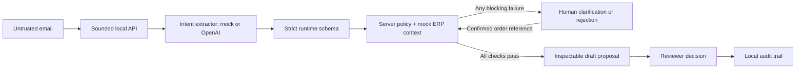

# Trelium Order Desk

A working, independent engineering demo by Akshay: customer email → customer and order context → structured intent → deterministic validation → inspectable ERP proposal → human decision and audit trail.

**Mock mode is the default. No API key, database account, or ERP connection is required. Approval never writes to an ERP.** The project does not claim affiliation with Trelium or use unverified company facts. All customers, contacts, orders, and prices are fictional.

## Run locally

Install Node.js 20.9 or later and pnpm (or npm).

```sh
pnpm install
pnpm dev
# Open http://127.0.0.1:3000/order-desk
```

The workspace explicitly allows only the esbuild dependency build script. The generated lockfile fixes the exact dependency versions. With npm, `npm install` and `npm run dev` also work, but pnpm is the reproducible path.

```sh
pnpm test
pnpm typecheck
pnpm build
pnpm start
```

Browser and API integration checks: start the local server, then run `pnpm test:browser`. The test uses installed Google Chrome by default (set `BROWSER_CHANNEL=chromium` after `pnpm exec playwright install chromium` if Chrome is unavailable). It tests the clear order, review resolution, policy bypass attempts, duplicate/concurrent approvals, custom email ingestion, and mobile overflow. Screenshots are saved in `test-results/`. **This test resets the sandbox before and after the run.**

The server binds to loopback by default. State is saved in `.data/workspace.json`, excluded from source control. Reset through the top-right reset button. Do not expose this application publicly without adding authentication and the production boundaries described below.

## Two-minute demo

1. Select **Clear order**, then **Run agent**. Maya's email resolves to Northstar. The agent extracts 120 BRG-6204 and 500 BLT-M8 under PO NS-4420. All ten checks pass. ERP catalog prices yield **$1,925** before taxes and freight. Inspect Customer & orders, source evidence, and Action details.
2. Add a reviewer note and **Approve proposal**. Show that the status changes and Activity records the decision, while `execution` remains `disabled`.
3. Select **Ambiguous case**, then **Run agent**. Northstar has two open orders. No proposal is created because “our bearing order” does not identify one. The UI offers clarification rather than guessing.
4. Simulate the customer's confirmation of **SO-2041**, choose it, and **Confirm & validate**. All checks rerun. The resulting amendment includes `expectedVersion: 3` and totals **$1,875**. Selecting SO-2056 instead stays in review: that order has a second line the agent must not silently remove.
5. Optional: run **Untrusted instructions**. Nine of ten checks pass, but the hostile-instruction guard blocks a proposal even at 90% coverage. Show the audit and disabled approval. No tool or ERP authority is given to the extractor.

Reset the sandbox before another walkthrough. Use **Add an email** to explore unknown senders, missing POs, unknown SKUs, fractional quantities, or insufficient stock. Custom email metadata is supplied by the operator; this demo does not authenticate a real email sender.

## Architecture



| File                             | Responsibility                                                                                                                                                      |
| -------------------------------- | ------------------------------------------------------------------------------------------------------------------------------------------------------------------- |
| `src/lib/seed.ts`                | Fictional customers, contact allowlist, catalog, stock, and versioned ERP orders                                                                                    |
| `src/lib/extractor.ts`           | Swappable extraction interface; strict Zod intent schema; deterministic mock and optional OpenAI adapter                                                            |
| `src/lib/agent.ts`               | Pure orchestration and policy: identity, untrusted content, completeness, order, PO duplicates, catalog, source evidence, amendment semantics, availability, credit |
| `src/lib/store.ts`               | Single-process transaction queue; atomic file replacement; persisted cases and audit records                                                                        |
| `src/app/api/workspace/route.ts` | Input limits, state transitions, stale revision rejection, duplicate approval checks, human decisions                                                               |
| `src/components/order-desk.tsx`  | Inbox, case workbench, review controls, evidence, ERP context, audit, payload export                                                                                |

The extractor returns intent, not an ERP action. It cannot choose prices, customer IDs, shipping addresses, or payment terms. Those come from the mock ERP. All extracted quantities need exact source excerpts. Any failed check blocks proposal creation; the 90% check-coverage threshold is an additional guard, not permission to bypass failures. **Coverage is the fraction of policy checks passed, not a calibrated probability.**

New orders require a PO and positive whole-number quantities. Amendments require a customer-owned open order and explicit replacement quantities for every existing line. Partial add/remove operations, delivery-date changes, shipping changes, pricing overrides, and unsupported mock grammar go to review. The reviewer can resolve only a missing order reference; they cannot click past identity, stock, commercial, or hostile-content failures. Corrected requests should be ingested as new emails.

## Optional LLM extraction

Copy `.env.example` to `.env.local` and opt in:

```dotenv
AGENT_PROVIDER=openai
OPENAI_API_KEY=your-key
OPENAI_MODEL=gpt-4.1-mini
```

Restart the server. The adapter uses the [OpenAI Responses API with structured outputs](https://developers.openai.com/api/docs/guides/structured-outputs). Only the email body and SKU/alias allowlist are sent to the provider; no key is exposed to the browser. `store: false`, a 20-second timeout, strict output schema, and server-side revalidation apply. Provider errors or malformed/incomplete output fail closed. There is no silent fallback to a mock result. Live mode can incur API charges and sends email content to OpenAI. The live adapter is implemented but is not verified against a credentialed service in this project.

## Tradeoffs and safety boundaries

- **Local JSON instead of PostgreSQL:** no database was configured in the empty workspace, so the MVP runs without credentials. File writes are serialized within one Node process and replaced atomically. This is appropriate for a local demo, not multiple workers, serverless instances, or durable enterprise records. `db/schema.sql` sketches the PostgreSQL migration; it is not wired to this application.
- **Deterministic mock instead of pretending to be AI:** it parses a documented subset and makes the same policy path reproducible. It is not a general email understanding engine. Live extraction needs evaluation on realistic distribution-company emails before use.
- **No real ERP adapter:** proposals and reviewer decisions are recorded; neither approval nor reset changes ERP seed data. Inventory/credit are snapshots and do not reserve anything. Even approved proposals are intent only.
- **Prompt injection:** email is data, rendered as escaped text. The extractor has no tools. Known suspicious patterns block proposals. A regex guard is not comprehensive injection detection; the durable boundary is constrained output plus deterministic policy and zero execution capability. Evidence grounding also does not prove full semantic fidelity.
- **Email identity:** exact allowlist lookup is demonstrated, but `.example` senders are operator-supplied. Production needs a verified ingestion channel and protection against spoofing and forwarded-message attribution errors.
- **Human review:** customer confirmation in the demo is simulated. There is no outreach integration. Reviewer identity is a local operator, not an authenticated user. A note is required; it records why the decision was made.
- **State and duplicates:** case revisions prevent stale/repeated approvals; the transaction queue checks an already-approved customer/PO pair atomically. Order amendments carry an ERP version. This is not distributed exactly-once delivery or an ERP-level unique constraint.
- **Audit:** records are appended by application operations and saved locally, but reset intentionally removes them and an operator can edit the file. Production needs restricted immutable audit storage, actor identities, retention rules, encryption, and tenant scoping.
- **Deployment:** no authentication, RBAC, rate limits, real email gateway, durable queue, or tenant isolation is implemented. Browser cross-origin mutations are rejected, but that is not authentication. Keep the demo local.

## Moving to production

Replace the file store with PostgreSQL transactions and tenant-scoped queries, connect authenticated email ingestion, add user identities and review permissions, then evaluate extraction precision and false approvals on a versioned corpus. Use an outbox worker for any ERP adapter, with idempotency keys, approval-bound payload hashes, fresh stock/credit checks, and optimistic order version checks at execution time. Keep the extractor unable to invoke writes. Add observability around stage latency, schema failures, review reasons, and reviewer overrides, with sensitive email content redacted.

See [ORDER_AGENT_DEMO.md](./ORDER_AGENT_DEMO.md) for a short walkthrough and explanation prompts. Framework setup follows the [Next.js App Router documentation](https://nextjs.org/docs/app/getting-started/installation).
